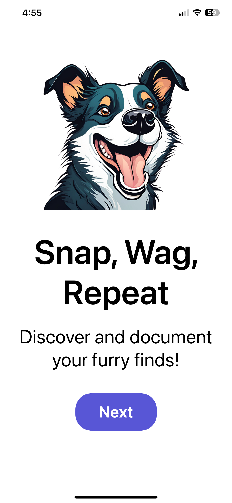
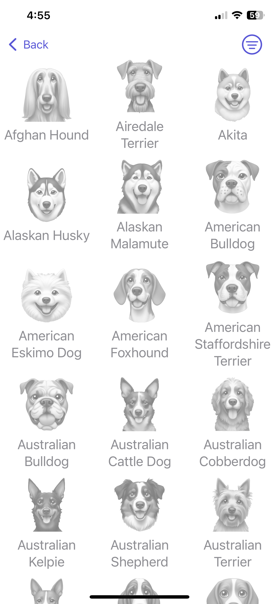
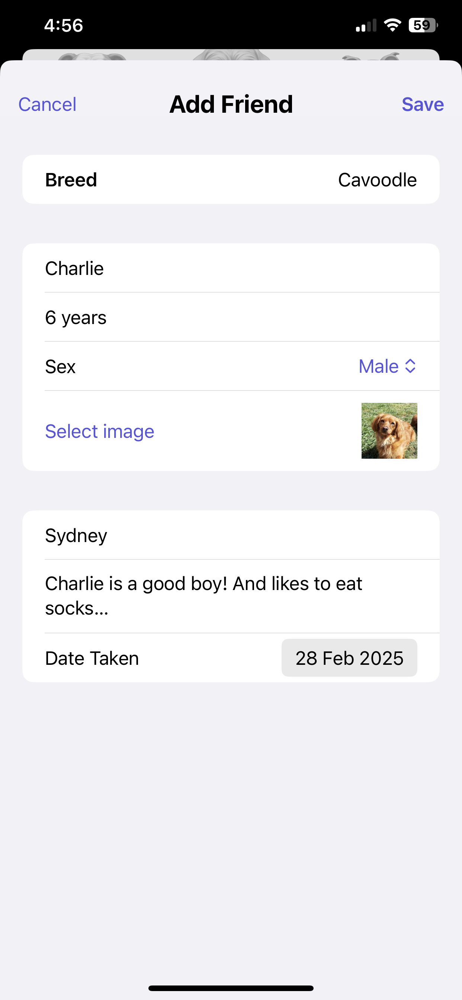

# FurFinder

FurFinder is a fun and interactive app designed to get you outdoors and connect with people through a shared love of dogs. With a list of 100+ dog breeds, users can capture photos of different breeds, add details like the dog's name, age, and a fun fact, and track their progress toward finding every listed breed. The app not only motivates users to explore their surroundings but also encourages conversation with strangers, making it a great way to meet new people and make friends along the way.

## Features

**Breed Collection**: Find and document over 100 dog breeds.

**Photo Capture & Storage**: Take pictures of dogs and store them in the app.

**Dog Details**: Add information such as name, age, and a fun fact for each dog.

**Progress Tracking**: Keep track of which breeds you’ve found.

**Encourages Social Interaction**: A great way to start conversations and meet fellow dog lovers.

**Cloud Storage**: Securely store data using AWS services.

## Tech Stack

**Frontend**: SwiftUI

**Backend**: AWS DynamoDB (Data Storage), AWS S3 (Photo Storage)

## Screenshots

    
    
    
    

## Demo Video

## Installation

1. Clone the repository: `git clone https://github.com/mhoppitt/furfinder.git`

2. Open the project in Xcode.

3. Run the app on a simulator or device.
